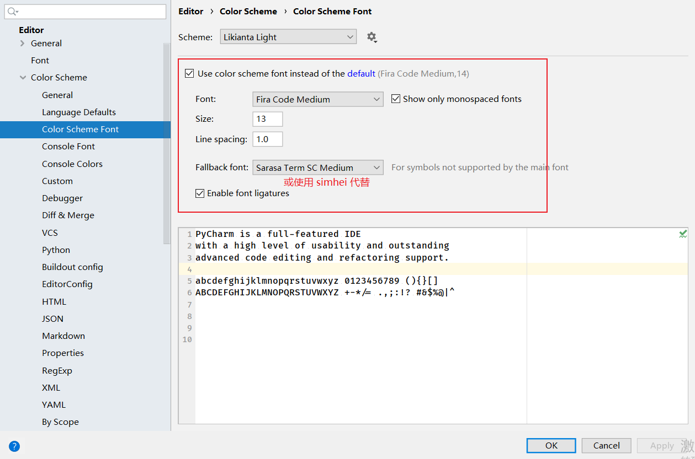
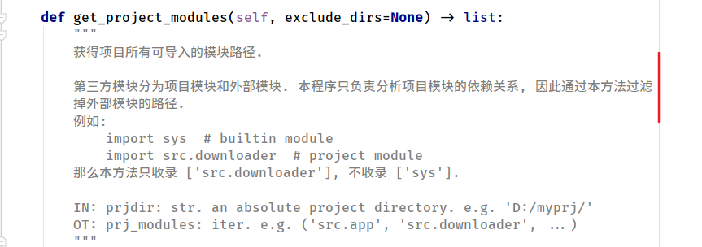

# pycallchain | Python 调用链分析工具

[TOC]

# 使用方法

pass

# 给开发者良好的阅读体验

请调整编辑器至以下字体设置:



中文字体将 "对齐" 显示:



------------------------------------------------

# 注意事项

本程序不支持处理以下特殊情况.

**case 1: global 变量**

```python

def aaa():
    print('aaa')
    global a
    a = bbb


def bbb():
    print('bbb')


if __name__ == '__main__':
    aaa()
    a()  # <- 这里的 `a()` 将无法被识别到.

```

**case 2: eval 函数**

```python

def aaa():
    print('aaa')


eval('aaa()')  # <- 这里的 `aaa()` 将无法被识别到.

```

**case 3: 抽象引用**

```python
from random import randint


def aaa():
    pass


def bbb():
    pass


adict = {0: aaa, 1: bbb}
rnd = randint(0, 1)
method = adict.get(rnd)()  # <- 这里的函数调用事件无法被识别到.

```


